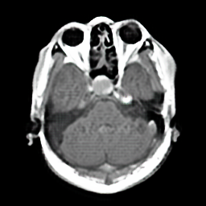

# Advancing Stroke Prediction: Harnessing the Power of Generative AI and Skin Disease Markers in MRI-CT Fusion

CT/MRI Classifier: Train Loss: 0.0254, Val Loss: 0.0275, Train 
Accuracy: 0.9901, Val Accuracy: 0.9954

Stroke Classifier: Train Loss: 0.0742, Train Accuracy: 97.25%

    python train.py --dataroot ./datasets/mri2ct --name mri2ct --model cycle_gan --display_id -1

    cp ./checkpoints/mri2ct/latest_net_G_A.pth ./checkpoints/mri2ct_pretrained/latest_net_G.pth

    python test.py --dataroot datasets/mri2ct/testA --name mri2ct_pretrained --model test --no_dropout

    python webapp/app.py --dataroot datasets/mri2ct/testA --name mri2ct_pretrained --model test --no_dropout